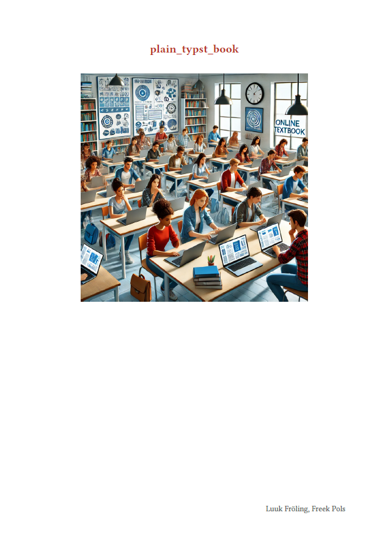

# MyST Template for Plain Typst Book

This repository, created by [Freek Pols](https://github.com/FreekPols/) and [Luuk Fröling](https://github.com/Luukfroling) provides a plain Typst book template designed for use with MyST - book theme (JB2). The template creates a PDF document as a [static export](https://mystmd.org/guide/quickstart-static-exports); in particular, it is designed to capture the non-interactive components of website made using the book theme (bundled with MyST, see [here](https://mystmd.org/guide/website-templates#default-web-themes)). This template is designed to help authors quickly set up a structured book project with MyST, ensuring a professional layout and easy customization. The primary use case of this template is to allow authors to easily maintain a single document in two formats; in other words: a website and PDF document using the same source code.

The template features:

- **Cover page**: Includes the book title, a cover figure, and author names. The cover figure can be vertically positioned (`coverpostion`) and resized (`cover_width`)
- **Preface**: Automatically generated from the `description` section in the `myst.yml` file.
- **Table of Contents**: Generated with a depth of 2 by default, can be specified in the myst.yml, the ToC can be toggled on/off using `show_ToC`
- **Logo**: A logo at the top of each page, with adjustable width (`logo_width`)
- **Adjustable layout**: Customizable page size (`papersize`), margins (`_top _bottom _left _right`), fonts (`fontstyle` and `fontsize`), line spacing (`linespacing`) and toggling pagenumber (`show_pagenumber`), justification and color themes (`colortheme` and `colorheadings`).


# Page settings


The PDF document contained in the repository in subdirectory `examples/` is generated using this template and will be updated when significant changes are made. A preview of the cover page is shown here:



## Usage

There are several ways to use this Typst template, described here briefly and non-exhaustively. For a full explanation, see the [documents](https://mystmd.org/guide/creating-pdf-documents#how-to-export-to-pdf). 

### Build using GH actions
Include the following in your `myst.yml` file:

```yaml
  downloads:
    - id: output-pdf1

  exports:
    - format: typst
      template: https://github.com/myst-templates/plain_typst_book.git
      output: export/book.pdf
      id: output-pdf1
      # additional options
```

Include [this file](https://github.com/TUD-JB-Templates/JB2/blob/main/.github/workflows/deploy-pdf-typst.yml) in `.github/workflows`. If you go to the `Actions` tab of your GitHub repository, you can manually trigger the workflow to build the PDF document. The resulting PDF will be available and can be downloaded from the GH-page of your book.

### Build locally
It is assumed you have MyST working on your computer and you can run the commands `myst build --pdf` and `myst start`.

```{warning} should be edited
```
- specify the GitHub repo in your `myst.yml` file as a template (include `*.git` at the end of the URL) or clone the repo and use it locally
- clone or download the repo, navigate your CLI to `./examples/` and run `myst build --pdf` to generate the PDF document; `myst start` will build the website and start a local server to view it
- clone or download the repo and copy the files in root to the working directory of your MyST book project; specify the directory with the files in your `myst.yml` file


## Ideas

File `style.typ` defines the layout and style of the book. We specifically pay attention to the cover page by specifying the page for the cover. We subsequently define the preface page and the table of contents page. Then we define the layout for the content of the book, setting a left margin to 20%.

File `template.typ` 'reads' the content from the `myst.yml` file and makes it available for the style.typ file. 

Files `aside_style.typ` is a file that helps to convert MyST aside to Typst notes.

You can specify a logo, cover and ToC_depth in your `myst.yml` file, under exports, or even better in a `export.yml` file using `extends`

```yaml
extends: 
  - export.yml
```

`export.yml` file:
```yaml
version: 1
project:

  plugins:
    - https://github.com/TUD-JB-Templates/JB2_plugins/releases/download/exercise/pdf_exercise.mjs

  downloads:
    - id: output-pdf1

  exports:
    - id: output-pdf1
      format: typst
      template: ../
      output: Test_typst_book_template2.pdf
# additional options #

# Include a figure at the cover page
      cover: Cover.PNG
      coverposition: 5  #in cm from title
      cover_width: 8 #in cm

# ToC
      ToC_depth: 2
      show_ToC: true

# Page settings
      #### Logo at top of position
      logo: logo.svg
      logo_width: 10

      #### Looks
      papersize: a4
      margin_top: 2 #cm
      margin_bottom: 2 #cm
      margin_left: 10 #%
      margin_right: 10 #%
      show_pagenumber: true

      #### Fonts
      fontsize: 12
      fontstyle: 
      linespacing: .5
      justification: false
      
      colortheme: blue.darken(30%)
      colorheadings: navy
      
```

```{note}
When the above options are not specified, default values are used as defined in `style.typ`.
```

The cover will be placed on the cover page, the logo will be placed in the header of each content page.

## License

Content is licensed under [MIT License](https://opensource.org/license/mit)
